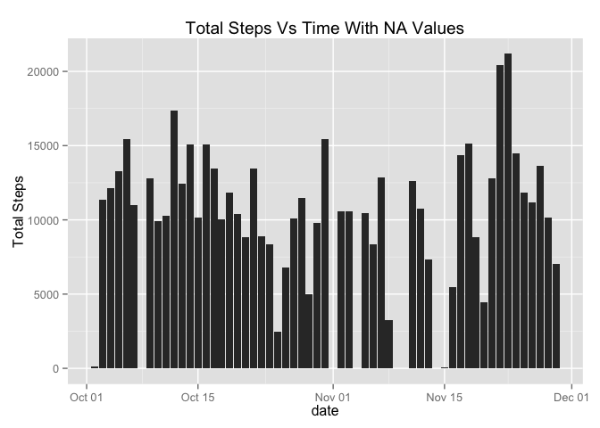
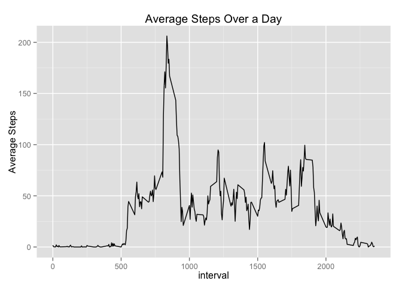
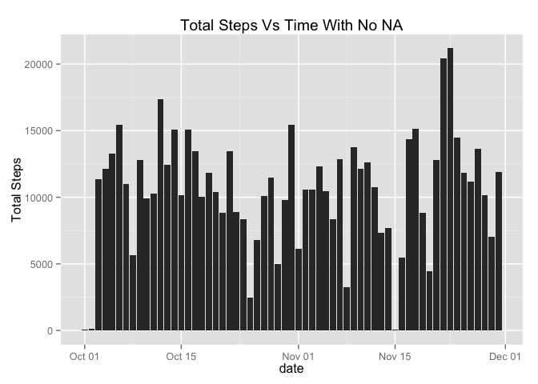
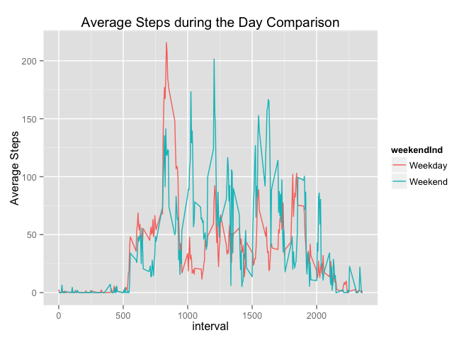

# Reproducible Research: Peer Assessment 1

Abu Nayeem

## Loading and preprocessing the data

Note: Install this: install.packages("lubridate") [handle dates] and install.packages("DataCombine") [handle lagged variables]
Loading and altering date to a date class.

```r
url <- "http://d396qusza40orc.cloudfront.net/repdata%2Fdata%2Factivity.zip"
download.file(url, "repdata-data-activity.zip", mode="wb")
unzip("repdata-data-activity.zip")
```


```r
library(plyr)
library(ggplot2)
library(lubridate)
library(DataCombine)
Activity<-read.csv("activity.csv", header=TRUE, sep=",",stringsAsFactors=FALSE)
Activity$date <- ymd(Activity$date)
str(Activity)
```

```
## 'data.frame':	17568 obs. of  3 variables:
##  $ steps   : int  NA NA NA NA NA NA NA NA NA NA ...
##  $ date    : POSIXct, format: "2012-10-01" "2012-10-01" ...
##  $ interval: int  0 5 10 15 20 25 30 35 40 45 ...
```

## What is mean total number of steps taken per day?
1) Make a histogram of the total steps taken each day


```r
TotalDay<- ddply(Activity,~date,summarise,TotSteps=sum(steps))
qplot(date,TotSteps,data=TotalDay, geom="histogram", stat="identity",main="Total Steps Vs Time With NA Values", ylab="Total Steps")
```

```
## Warning: Removed 8 rows containing missing values (position_stack).
```

 

2) Calculate and report the mean and median total number of steps taken per day

```r
mean(TotalDay$TotSteps,na.rm=TRUE)
```

```
## [1] 10766
```

```r
median(TotalDay$TotSteps,na.rm=TRUE)
```

```
## [1] 10765
```


## What is the average daily activity pattern?

1) Make a time series plot (i.e. type = "l") of the 5-minute interval (x-axis) and the average number of steps taken, averaged across all days (y-axis)

Implement a similar strategy but watch out for missing values


```r
AverStepInterval<- ddply(Activity,~interval,summarise,AverSteps=mean(steps,na.rm=TRUE))
qplot(interval,AverSteps,data=AverStepInterval, geom="line", main="Average Steps Over a Day", ylab="Average Steps")
```

 

2) Which 5-minute interval, on average across all the days in the dataset, contains the maximum number of steps?


```r
a<-max(AverStepInterval$AverSteps)
Test<-subset(AverStepInterval,AverStepInterval$AverSteps==a)
Test$interval
```

```
## [1] 835
```

## Imputing missing values

1) Calculate and report the total number of missing values in the dataset (i.e. the total number of rows with NAs)


```r
summary(Activity$steps)
```

```
##    Min. 1st Qu.  Median    Mean 3rd Qu.    Max.    NA's 
##     0.0     0.0     0.0    37.4    12.0   806.0    2304
```
See NA column

2) Devise a strategy for filling in all of the missing values in the dataset. The strategy does not need to be sophisticated. For example, you could use the mean/median for that day, or the mean for that 5-minute interval, etc.

I remarked missing values are associated for entire days. The best option is to average the interval steps of the day above and below the missing value. Thus I am interested in creating lagged and ahead variable. Note each day is 288 days apart and hence that was used to determine the lag/ahead. Also the slide package is pretty awful


```r
LagDaySteps<-slide(Activity,Var="steps",slideBy=-288)
```

```
## 
## Remember to put Activity in time order before running.
## 
## Lagging steps by 288 time units.
```

```r
ProLagDaySteps<-slide(LagDaySteps,Var="steps",slideBy=288)
```

```
## 
## Remember to put LagDaySteps in time order before running.
## 
## Leading steps by 288 time units.
```

```r
ProLagDaySteps$lag<- ProLagDaySteps[,4]
ProLagDaySteps<- ProLagDaySteps[,-4]
ProLagDaySteps$ahead<- ProLagDaySteps[,4]
ProLagDaySteps<- ProLagDaySteps[,-4]
ProLagDaySteps$lag[is.na(ProLagDaySteps$lag)] <-0
ProLagDaySteps$ahead[is.na(ProLagDaySteps$ahead)] <-0
ProLagDaySteps$steps[is.na(ProLagDaySteps$steps)] <- (ProLagDaySteps$ahead + ProLagDaySteps$lag)/2
```

```
## Warning: number of items to replace is not a multiple of replacement
## length
```

```r
summary(ProLagDaySteps$steps)
```

```
##    Min. 1st Qu.  Median    Mean 3rd Qu.    Max. 
##     0.0     0.0     0.0    36.4    14.0   806.0
```
Despite the warning, it came out as I wanted.

3) Create a new dataset that is equal to the original dataset but with the missing data filled in.


```r
FullActivity<-ProLagDaySteps[,-c(4,5)]
```
I simply removed the lag and ahead variable

4) Make a histogram of the total number of steps taken each day and Calculate and report the mean and median total number of steps taken per day. Do these values differ from the estimates from the first part of the assignment? What is the impact of imputing missing data on the estimates of the total daily number of steps?

Essentially identical to part 2
a) Make a histogram of the total steps taken each day

```r
FullTotalDay<- ddply(FullActivity,~date,summarise,TotSteps=sum(steps))
qplot(date,TotSteps,data=FullTotalDay, geom="histogram", stat="identity", main="Total Steps Vs Time With No NA", ylab="Total Steps")
```

 

b) Calculate and report the mean and median total number of steps taken per day

```r
mean(FullTotalDay$TotSteps)
```

```
## [1] 10497
```

```r
diffmean<-mean(FullTotalDay$TotSteps)- mean(TotalDay$TotSteps,na.rm=TRUE)
diffmean
```

```
## [1] -268.9
```

```r
median(FullTotalDay$TotSteps)
```

```
## [1] 10765
```

```r
diffmedian<-median(FullTotalDay$TotSteps)- median(TotalDay$TotSteps,na.rm=TRUE)
diffmedian
```

```
## [1] 0
```
The median stayed the same which was surprising, but the mean has decreased, implying these new data are weighted toward lower end of spectrum which was pretty obvious with the first table. Of course, aggregate steps must increase monotonously when fill in missing data

## Are there differences in activity patterns between weekdays and weekends?

1) Create a new factor variable in the dataset with two levels – “weekday” and “weekend” indicating whether a given date is a weekday or weekend day.

I made the weekend/weekday indicators into a single factor variable

```r
FullActivity$week <- weekdays(FullActivity$date)
FullActivity$weekendInd <- FullActivity$week=="Sunday" | FullActivity$week=="Satruday"
FullActivity$weekendInd[FullActivity$weekendInd==TRUE]<-"Weekend"
FullActivity$weekendInd[FullActivity$weekendInd==FALSE]<-"Weekday"
FullActivity$weekendInd<-as.factor(FullActivity$weekendInd)
```

2) Make a panel plot containing a time series plot (i.e. type = "l") of the 5-minute interval (x-axis) and the average number of steps taken, averaged across all weekday days or weekend days (y-axis). 

I USE AN ALTERNATIVE PLOT!


```r
WeekAverStepInterval<- ddply(FullActivity,.(interval,weekendInd),summarise,AverSteps=mean(steps))
qplot(interval,AverSteps,data=WeekAverStepInterval, geom="line", col=weekendInd, main="Average Steps during the Day Comparison", ylab="Average Steps")
```

 

We can clearly see that on average people run more on the weekends because they have more time overall but we see peak of activity of the weekday indicating that people follow a routine on weekday. Probably taking a jog prior to heading to work. I think this will suffice in ending my analysis

