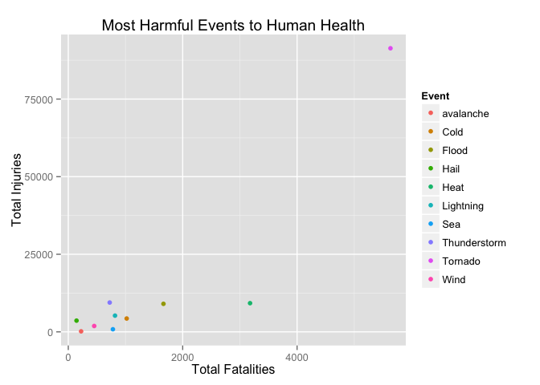
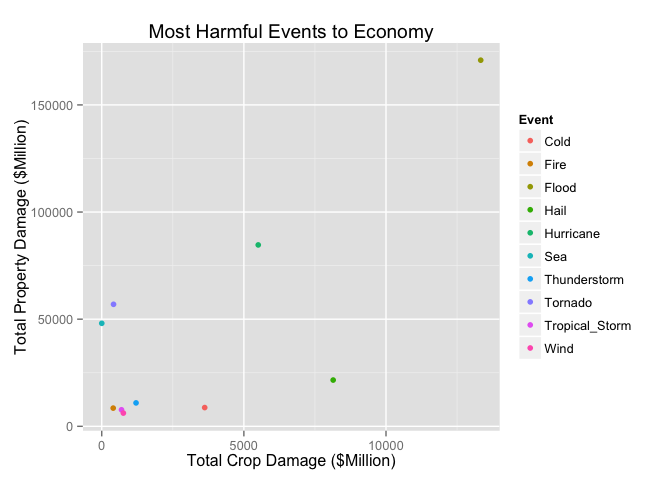

# Reproducible Research: Peer Assessment 2
Abu Nayeem  
September 7, 2014  

## Title: Human and Economic Cost of Destructive Storms on the American Heartland

## Synopsis

Data Analysis:
This analysis will utilize  the U.S. National Oceanic and Atmospheric Administration's (NOAA) storm database [from 1950-2011]. This database tracks characteristics of major storms and weather events in the United States, including when and where they occur, as well as estimates of any fatalities, injuries, and property damage. In this report, I will assess both the total damages and the average damages incurred by each  event. My preliminary results show that less unpredictable events such as tornadoes and flooding cause greater fatalities/casualties and considerable economic damage. While extreme coastal events, such as hurricane, impart massive property damage. The Results section goes in more depth. Enjoy!    

Disclaimer:
Working with the data was fairly tedious because the event type designation varied considerably with some labels unclear, redundant, and misspelling. I categorized the event types as seen in Event-Type Cleaning section. Note the cleaning process has its limitations, particularly some entries had characteristics of two entries, and whichever coding came first was designated to that category.

## Data Processing

Preliminary (Standard): Note- R.Utils is needed to unzip the raw file

```r
if (!file.exists("./Repository Important")) {
     dir.create("./Repository Important")
}
library(plyr)
library(ggplot2)
library(dplyr)
library(R.utils)
url <- "https://d396qusza40orc.cloudfront.net/repdata%2Fdata%2FStormData.csv.bz2"
download.file(url, "repdata-data-StormData.csv.bz2", method="curl")
bunzip2("repdata-data-StormData.csv.bz2",dest="repdata-data-StormData.csv", overwrite=TRUE, exdir="./Repository Important")
```
Loading: 

I converted several columns to lower case because I will search the strings later, and it is jumbled in the raw data. In addition, I put the primary data in tbl_df, which gives me numerous options, it's particularly useful in the results section.

```r
StormData<-read.csv("repdata-data-StormData.csv", header=TRUE, sep=",")
StormData$EVTYPE<-tolower(StormData$EVTYPE)
StormData$CROPDMGEXP<-tolower(StormData$CROPDMGEXP)
StormData$PROPDMGEXP<-tolower(StormData$PROPDMGEXP)
StormData<- tbl_df(StormData)
StormData <-mutate(StormData,Event=EVTYPE)
StormData <-select(StormData,-EVTYPE)
```

Event Type Cleaning Process:

There is a lot of event types that are the same but look different, due to misspelling, syntax and such. Read the disclaimer in the Synoopsis for greater detail.
Method: I parse key words for event type. This create a vector of indices, which is then used to substitute the value back


```r
a<-grep("cold|winter|hypothermia|cool|chill|blizzard|snow|wintry|freeze|freezing",StormData$Event,value=FALSE)
StormData[a,37]<-"Cold"
a<-grep("lightning",StormData$Event,value=FALSE)
StormData[a,37]<-"Lightning"
a<-grep("hail|ice|sleet",StormData$Event,value=FALSE)
StormData[a,37]<-"Hail"
a<-grep("flood|rain|water|flooding|shower|precipitation|floooding|wet|fld",StormData$Event,value=FALSE)
StormData[a,37]<-"Flood"
a<-grep("warm|hot|heat|high temperature",StormData$Event,value=FALSE)
StormData[a,37]<-"Heat"
a<-grep("tunderstorm|tstm|thunderstorm",StormData$Event,value=FALSE)
StormData[a,37]<-"Thunderstorm"
a<-grep("tornado|tornadoe|torndao|gustnado",StormData$Event,value=FALSE)
StormData[a,37]<-"Tornado"
a<-grep("fire",StormData$Event,value=FALSE)
StormData[a,37]<-"Fire"
a<-grep("wind| wnd",StormData$Event,value=FALSE)
StormData[a,37]<-"Wind"
a<-grep("tropical",StormData$Event,value=FALSE)
StormData[a,37]<-"Tropical_Storm"
a<-grep("hurricane",StormData$Event,value=FALSE)
StormData[a,37]<-"Hurricane"
a<-grep("surf|sea|tide|wave|coastal|beach|surge|riff|current",StormData$Event,value=FALSE)
StormData[a,37]<-"Sea"
a<-grep("dry|dust",StormData$Event,value=FALSE)
StormData[a,37]<-"Dry"
a<-grep("mud",StormData$Event,value=FALSE)
StormData[a,37]<-"MudSlide"
```

Monetary Damage Cleaning Process:

The currency indicator has some weird values which need to be removed (NA). The money conversion will be millions of US Dollars. The conversion is the following: m=1; b(billion)=1000, k(thousand)=0.001.
Method: A parse strings that are not primary convertors and replace them with NA. Then I implement the conversion and save it under new variables (MpropDmg, and CpropDmg)

```r
a<-grep("[^bmk]",StormData$PROPDMGEXP,value=FALSE)
StormData[a,25]<-NA
StormData$PROPDMGEXP[StormData$PROPDMGEXP=="b"]<-"1000"
StormData$PROPDMGEXP[StormData$PROPDMGEXP=="k"]<-"0.001"
StormData$PROPDMGEXP[StormData$PROPDMGEXP=="m"]<-"1"
a<-as.numeric(as.character(StormData$PROPDMGEXP))
StormData$PropInc<-a
StormData<-mutate(StormData,MpropDmg=PROPDMG * PropInc)

a<-grep("[^bmk]",StormData$CROPDMGEXP,value=FALSE)
StormData[a,27]<-NA
StormData$CROPDMGEXP[StormData$CROPDMGEXP=="b"]<-"1000"
StormData$CROPDMGEXP[StormData$CROPDMGEXP=="k"]<-"0.001"
StormData$CROPDMGEXP[StormData$CROPDMGEXP=="m"]<-"1"
a<-as.numeric(as.character(StormData$CROPDMGEXP))
StormData$CropInc<-a
StormData<-mutate(StormData,McropDmg=CROPDMG * CropInc)
```

Collapsing the Data by Event:

Method: I take advantage of the tbl_df functionality, and use group_by() to group all operations under event type. Then I create a new dataframe that collapse the groups while obtaining summing up variables of interest, and count. Finally I construct average variables to add more insight.  

```r
by_Ev_StormData<-group_by(StormData,Event)
by_Event_StormData<-summarize(by_Ev_StormData, count=n(),TotFatal=sum(FATALITIES,na.rm = TRUE),TotInjuries=sum(INJURIES, na.rm = TRUE), TotMPropDmg=sum(MpropDmg, na.rm = TRUE), TotMCropDmg=sum(McropDmg,na.rm = TRUE))
by_Event_StormData<-mutate(by_Event_StormData, AvgFatal=TotFatal/count, AvgInjuries=TotInjuries/count, AvgMPropDmg=TotMPropDmg/count, AvgMCropDmg=TotMCropDmg/count)
```

## Results

Task 1) Across the United States, which types of events (as indicated in the EVTYPE variable) are most harmful with respect to population health?

There is simply too much event types, lets take the top 10 types for total fatalities and graph [scatterplot] it respect to total injuries. 

```r
by_Event_StormData <- arrange(by_Event_StormData, desc(TotFatal))
qplot(TotFatal,TotInjuries,data=by_Event_StormData[c(1:10),], col=Event,ylab="Total Injuries", xlab="Total Fatalities", main="Most Harmful Events to Human Health") 
```

 

```r
by_Event_StormData %>% arrange(desc(TotFatal)) %>% select(1,2,3,4,7,8)
```

```
## Source: local data frame [163 x 6]
## 
##           Event  count TotFatal TotInjuries  AvgFatal AvgInjuries
## 1       Tornado  60692     5633       91364 0.0928129     1.50537
## 2          Heat   2997     3178        9243 1.0603937     3.08408
## 3         Flood 101970     1664        9033 0.0163185     0.08858
## 4          Cold  44694     1021        4302 0.0228442     0.09625
## 5     Lightning  15776      817        5232 0.0517875     0.33164
## 6           Sea   2621      780         835 0.2975963     0.31858
## 7  Thunderstorm 335668      724        9447 0.0021569     0.02814
## 8          Wind  26308      453        1891 0.0172191     0.07188
## 9     avalanche    386      224         170 0.5803109     0.44041
## 10         Hail 292585      144        3621 0.0004922     0.01238
## ..          ...    ...      ...         ...       ...         ...
```

Analysis:
We can see fatalities are rare respect to number of total injuries. There is no doubt tornado is the most dangerous event as total fatalities and total injuries are high. In addition, it is frequent and has the highest average fatalities/injuries ratio [excluding Heat]. More sudden events like tornado, lightning, and flash flood cause more deaths probably due less preparation. The amount of fatalities associated with excessive heat/heat show that many persons are inadequately prepared or underestimate heat advisories.


Task 2) Across the United States, which types of events have the greatest economic consequences?

Lets take the top 10 types for total property damage and graph it respect to total crop damage.

```r
by_Event_StormData <- arrange(by_Event_StormData, desc(TotMPropDmg))
qplot(TotMCropDmg,TotMPropDmg,data=by_Event_StormData[c(1:10),], col=Event, xlab="Total Crop Damage ($Million)",ylab="Total Property Damage ($Million)", main="Most Harmful Events to Economy") 
```

 

```r
by_Event_StormData %>% arrange(desc(TotMPropDmg)) %>% select(1,2,5,6,9,10)
```

```
## Source: local data frame [163 x 6]
## 
##             Event  count TotMPropDmg TotMCropDmg AvgMPropDmg AvgMCropDmg
## 1           Flood 101970      170871   13331.740     1.67570   1.307e-01
## 2       Hurricane    287       84656    5505.293   294.96927   1.918e+01
## 3         Tornado  60692       56942     414.963     0.93821   6.837e-03
## 4             Sea   2621       48078       0.855    18.34320   3.262e-04
## 5            Hail 292585       21588    8141.327     0.07378   2.783e-02
## 6    Thunderstorm 335668       10930    1206.849     0.03256   3.595e-03
## 7            Cold  44694        8746    3622.014     0.19568   8.104e-02
## 8            Fire   4239        8497     403.282     2.00439   9.514e-02
## 9  Tropical_Storm    757        7716     694.896    10.19304   9.180e-01
## 10           Wind  26308        6173     760.820     0.23465   2.892e-02
## ..            ...    ...         ...         ...         ...         ...
```

Analysis: Floods, by far, is the most destructive in both property and crop damages ($170 billion total). From the table, we see crops are most vulnerable to hailstorms, floods, and fire. This is reasonable since these events encompass large surface area and crops and vulnerable to impact. For property damage, tornados and more frequent events such as hail and thunderstorms are costly to US economy. Finally, we see coastal events and hurricanes doing massive property damage per occurence. There are several reasons for this: 1) coastal areas are more densely populated than the interior and 2) the real estate values of homes are considerably higher. That completes my report.


